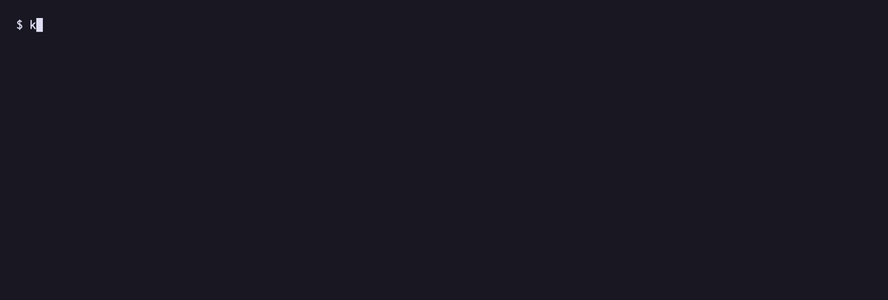
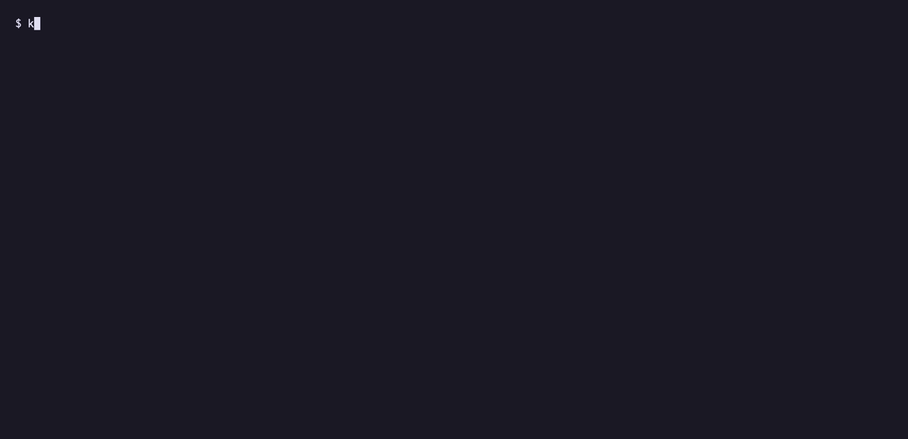
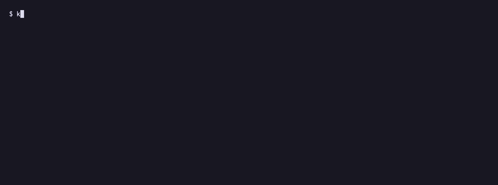
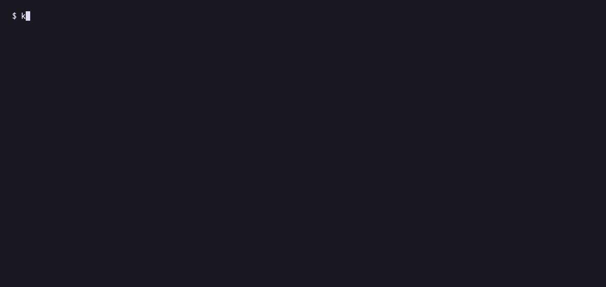

# Kigtit

**되돌릴 수 있다는 확신** — 바이브 코딩하는 비개발자를 위한 세이브 포인트.

깃 용어를 하나도 쓰지 않습니다. 커밋 버튼도, 브랜치도 없습니다. 있는 것은
*내가 시킨 일의 목록*과 *여기로 되돌리기* 버튼 하나입니다.

터미널에서 `kigtit`만 치면 됩니다.



AI가 언제부터 망쳤는지, 어디로 돌아가야 하는지가 한눈에 보입니다.

---

## 왜 만들었나

기존 깃 GUI(Sourcetree, GitKraken, GitHub Desktop)는 *깃을 아는데 CLI가 귀찮은
개발자*를 위한 도구입니다. 바이브 코더의 문제는 다릅니다.

1. **AI가 잘 되던 걸 망쳤는데 어디로 돌아가야 할지 모른다** — 압도적 1위
2. **무엇이 바뀐지 모른다** — diff를 못 읽는다. 파일 30개 변경 = 공포
3. **API 키를 커밋해서 유출한다** — 실제로 돈을 잃는 지점

Kigtit은 이 세 가지만 풉니다. 나머지는 하지 않습니다.

## 설치

```sh
git clone https://github.com/yunhwane/kigtit
cd kigtit

cargo install --path crates/cli          # kigtit 명령
pnpm install && cargo tauri build        # Kigtit.app (선택)
cp -R target/release/bundle/macos/Kigtit.app ~/Applications/
```

필요한 것: Rust, Node(앱을 만들 때만), macOS.

**있으면 좋은 것** — 없어도 동작합니다.

| | 무엇이 좋아지는가 | 없으면 |
|---|---|---|
| `claude` 또는 `codex` | 바뀐 내용을 사람 말로 설명 | 파일 목록만 보여줌 |
| `gh` | GitHub 백업·맞추기 | 백업 기능만 못 씀 |

**API 키나 토큰을 입력하는 화면은 없습니다.** 이미 로그인해 둔 CLI를 빌려 쓰기만
합니다. 자세한 이유는 [아래](#api-키를-받지-않습니다)에.

## 5분 만에 써보기

### 1. 폴더 열기

```sh
cd ~/내-프로젝트
kigtit
```

git 저장소가 아니어도 됩니다. 아무것도 묻지 않고 준비하고, `.gitignore`에
`node_modules/`·`.env`·빌드 산출물을 자동으로 넣습니다.

### 2. 자동 저장 켜기

```sh
kigtit watch
```

이제 **저장 버튼을 누를 일이 없습니다.** 파일이 바뀌고 3초 조용해지면 알아서
담습니다. AI가 파일을 쏟아내는 동안은 계속 기다리므로, **시도 한 번이 세이브
포인트 하나**가 됩니다.



한 번 담을 때마다 세 가지가 일어납니다.

```
  …  파일 1개가 바뀌었어요
  ●  담았어요  169d4e6  자동 저장 · 파일 1개
  ■  여기서 앱이 안 켜졌어요  (문법 검사)          ← 실제로 돌려서 확인한다
     *** Error compiling './oops.py'...
       File "./oops.py", line 1
         def broken(
                   ^
  ↳  169d4e6  새 파일 추가 (미완성) — oops.py라는 새로운 파일이 만들어졌습니다.
             하지만 파일의 코드가 완성되지 않은 상태입니다.   ← AI가 사람 말로
```

### 3. 망쳤으면 되돌리기

```sh
kigtit list           # 어디서 망가졌는지 본다
kigtit back 2715681   # 그 앞으로 돌아간다
```

되돌리기는 **새 세이브 포인트로 기록됩니다.** 그래서 되돌린 것도 되돌릴 수 있고,
작업이 영구히 사라지는 경로가 앱 안에 존재하지 않습니다.

### 4. GitHub에 백업

```sh
kigtit backup
```

기본은 **비공개**입니다. 토큰을 만들 필요 없습니다.

---

## 명령 하나하나

### `kigtit` — 타임라인

인수 없이 치면 지금 폴더의 타임라인이 나옵니다.

```
$ kigtit

  ◆  지금          아직 저장되지 않은 변경 2개
  │               app/page.tsx, lib/menu.ts
  │               `kigtit save`로 담을 수 있어요
  │
  ■  오후 2:47     장바구니 표시 추가                    801b8bf
  │               장바구니에 담긴 상품을 보여주는 화면이 새로 만들어졌습니다.
  │               첫 번째 상품의 이름 다음에 나머지 개수를 표시해서 사용자가
  │               장바구니 내용을 한눈에 볼 수 있게 됩니다.
  │               여기서 앱이 안 켜졌어요  → kigtit back 2715681  (주문 버튼 디자인 변경)
  │               *** Error compiling './cart.py'...
  │
  ●  오후 2:31     주문 버튼 디자인 변경                  2715681
  │               주문하기 버튼이 초록색에서 파란색으로 바뀌었습니다. 버튼의
  │               모서리가 더 둥글어지고 그림자 효과가 추가되었습니다.
  │
  ○  오후 1:20     프로젝트 시작                         da8d2b9
```

읽는 법:

| 표시 | 뜻 |
|---|---|
| `●` 초록 | 이 시점에서 앱이 잘 켜졌다 |
| `■` 빨강 | **여기서부터 앱이 안 켜졌다** — 아래 줄에 이유와 돌아갈 곳이 나온다 |
| `○` 회색 | 아직 확인하지 않았다 |
| `◆` 자주 | 아직 담기지 않은 변경 |

색만으로 말하지 않습니다. 도형이 같이 붙어서 색맹 사용자와 흑백 출력에서도
구분됩니다.

```sh
kigtit list --limit 30    # 더 많이 보기
```

### `kigtit watch` — 자동 저장

```sh
kigtit watch              # 3초 유휴 후 자동 저장
kigtit watch --idle 10    # 10초로 늘리기
```

끄려면 `Ctrl+C`. 강제로 꺼도 괜찮습니다 — 다시 켜면 놓친 요약을 이어서 채웁니다.

### `kigtit save` — 직접 담기

```sh
kigtit save                    # 제목을 AI가 붙여준다
kigtit save "메뉴 사진 추가"     # 제목을 직접 쓴다
kigtit save --no-summary       # AI 요약을 기다리지 않는다
```

```
$ kigtit save
  ●  저장했어요 2715681  자동 저장 · 파일 1개
     Claude Code로 요약하는 중…
     주문 버튼 디자인 변경
     주문하기 버튼이 초록색에서 파란색으로 바뀌었습니다. 버튼의 모서리가
     더 둥글어지고 크기가 커졌으며, 그림자 효과가 추가되었습니다.
```

### `kigtit show` — 무엇이 바뀌었는지

```sh
kigtit show                  # 가장 최근 것
kigtit show 801b8bf          # 특정 시점
kigtit show 801b8bf --code   # 코드까지 펼치기
```

사람 말 설명이 위에 오고, 코드는 `--code`를 줄 때만 나옵니다.

### `kigtit undo` / `kigtit back` — 되돌리기

```sh
kigtit undo               # 마지막 세이브 포인트 이전으로
kigtit back 2715681       # 특정 시점으로
```


```
$ kigtit back 2715681
  ●  주문 버튼 디자인 변경 시점으로 되돌렸어요 2715681
     되돌리기 직전 상태는 c871216에 담아뒀어요.
     되돌린 것도 되돌릴 수 있어요 → kigtit undo
```

작업 중이던 미저장 변경이 있어도 괜찮습니다. 되돌리기 전에 먼저 담아 두므로
잃는 것이 없습니다.

### `kigtit health` — 앱이 켜지는지 확인

저장할 때 알아서 돕니다. 지금 당장 다시 보고 싶을 때만 씁니다.

```
$ kigtit health
  확인하는 중… (문법 검사)
  ■  여기서 앱이 안 켜졌어요  (문법 검사)

     *** Error compiling './cart.py'...
       File "./cart.py", line 4
         return sum(i["price"] for i in items
                   ^
     SyntaxError: '(' was never closed

  마지막으로 잘 켜졌던 시점으로 돌아가려면 `kigtit list`를 보세요.
```

판정이 틀렸으면 직접 고쳐 쓸 수 있습니다.

```sh
kigtit mark ok
kigtit mark broken
kigtit mark unknown 801b8bf
```

### `kigtit check` — 위험한 파일

```sh
kigtit check          # 검사만
kigtit check --fix    # 대용량 파일을 백업에서 바로 빼기
```

```
$ kigtit check
  ■  assets/promo.mov 파일이 7MB예요. 백업에 넣으면 나중에 느려집니다.
     추천: 백업에서 빼두기
  ▲  lib/openai.ts 2번째 줄에 OpenAI 키처럼 보이는 값이 있어요.
     이대로 올리면 남이 가져다 쓸 수 있습니다.
     sk-proj-••••••B4nM
     추천: 키를 .env 파일로 옮기고 백업에서 빼두기
```

값 전체는 화면에 절대 나오지 않습니다.

### `kigtit backup` — GitHub에 백업

```sh
kigtit backup             # 비공개로 (기본)
kigtit backup --public    # 누구나 볼 수 있게
kigtit backup --status    # 올리지 않고 상태만
```

```
$ kigtit backup
  ●  yunhwane 계정으로 올릴 수 있어요
     아직 연결된 곳이 없어요. 새로 만들어 드릴게요.
     백업 안 된 세이브 포인트 2개

  나만 볼 수 있게 올립니다.
  올리는 중…
  ●  백업했어요 — 세이브 포인트 2개
     https://github.com/yunhwane/내-프로젝트.git
     저장소를 새로 만들었어요.
```

키가 하나라도 있으면 **올리지 않습니다.**



### `kigtit sync` — GitHub와 맞추기

다른 컴퓨터에서 한 작업을 가져옵니다.

```sh
kigtit sync                 # 가져와서 맞추기
kigtit sync --keep mine     # 겹친 파일을 내 것으로
kigtit sync --keep theirs   # 겹친 파일을 GitHub 것으로
```

겹치면 멈추고 물어봅니다. **이때 작업 폴더는 건드리지 않습니다.**



### `kigtit open` — 앱 창으로 열기

```sh
kigtit open
```

터미널에서 작업하다가 눈으로 보고 싶을 때. 앱이 그 폴더로 바로 들어갑니다.

### `kigtit summarize` — 요약 채우기

```sh
kigtit summarize
kigtit summarize --limit 50
```

`--no-summary`로 담았거나 앱이 갑자기 꺼져서 빠진 요약을 채웁니다.

---

## 앱 쓰기

```sh
kigtit open        # 또는 응용 프로그램 폴더에서 Kigtit 실행
```

화면 설계는 [`design/screens.html`](design/screens.html)을 브라우저로 열면
전부 볼 수 있습니다.

| 화면 | 하는 일 |
|---|---|
| **타임라인** | 좌측 프로젝트 / 중앙 타임라인 / 우측 상세. 노드 하나 = 내가 시킨 일 한 번 |
| **상세** | 사람 말 설명이 위, 코드는 "코드로 보기"를 눌러야 펼쳐짐 |
| **되돌리기** | "되돌린 것도 되돌릴 수 있어요" — 이 한 줄이 버튼을 누르게 만든다 |
| **선택이 필요해요** | 양쪽이 뭘 하려 했는지 읽고 파일마다 고르기 |
| **키 유출 경고** | 자동 저장을 멈추는 유일한 순간 |

앱은 프로젝트를 열면 자동 저장 감시를 스스로 띄웁니다. `kigtit watch`를 따로
켜지 않아도 됩니다.

---

## 설계 원칙

| | |
|---|---|
| **커밋 버튼이 없다** | 파일이 바뀌고 3초 조용해지면 알아서 담는다. "저장해야 한다"를 배우지 않아도 된다. |
| **되돌리기도 기록된다** | `reset --hard`를 쓰지 않는다. 되돌림은 새 세이브 포인트로 남는다. 작업이 영구히 사라지는 경로가 앱 안에 없다. |
| **diff보다 문장이 먼저** | 모든 설명이 코드가 아니라 사람 말이다. 코드는 원할 때만 펼친다. |
| **"앱이 켜졌는가"가 타임라인에 박힌다** | 저장할 때마다 실제로 빌드를 돌려 본다. 실패하면 그 이유까지 보여준다. |
| **충돌에 hunk 병합을 요구하지 않는다** | `<<<<<<< HEAD`를 보여주지 않는다. 양쪽이 뭘 하려 했는지 설명하고 파일 단위로 고르게 한다. |
| **상태를 색만으로 말하지 않는다** | 잘 켜짐 `●`, 실패 `■`, 경고 `▲`. 색맹 사용자와 흑백 출력에서도 구분된다. |
| **위험한 것만 막는다** | 비밀 키, 대용량 파일, 의존성 폴더. 그 외에는 아무것도 묻지 않는다. |

### 용어 대응표

| Git | 화면에 쓰는 말 | 이유 |
|---|---|---|
| commit | 세이브 포인트 | 게임에서 이미 배운 개념 |
| revert / reset | 여기로 되돌리기 | 둘의 차이를 사용자가 알 필요 없음 |
| branch | 다른 방법으로 해보기 | 목적을 이름으로 씀 |
| diff | 무엇이 바뀌었나 | 질문 형태가 더 읽힘 |
| push | GitHub에 백업 | 백업은 누구나 아는 말 |
| pull | GitHub와 맞추기 | |
| merge conflict | 선택이 필요해요 | 충돌은 겁을 주고, 선택은 행동을 부름 |
| .gitignore | 백업에서 빼두기 | 파일 이름을 노출하지 않음 |

---

## API 키를 받지 않습니다

사람 말 요약은 **이미 설치된 AI CLI를 그대로 빌려 씁니다.** 타겟 사용자는 바이브
코더이므로 `claude`나 `codex`가 이미 깔려서 로그인까지 끝나 있습니다. 백업도
같은 이유로 이미 로그인된 `gh`를 빌려 씁니다.

- 설정 화면이 없다
- 요금이 따로 붙지 않는다
- 키가 유출될 표면이 애초에 없다

우선순위는 `claude` → `codex` → 규칙 기반 폴백입니다. 아무것도 없어도 기능이
죽지 않고, 파일 목록으로 만들 수 있는 만큼만 말합니다.

### 요약은 나중에 붙습니다

요약 하나에 8초쯤 걸립니다. 커밋 메시지를 고치면 해시가 바뀌므로,
`refs/notes/kigtit`에 JSON으로 나중에 붙입니다. **해시는 그대로 유지됩니다.**

대기열을 파일로 따로 두지 않습니다 — "요약이 없는 세이브 포인트" 자체가
대기열이고 그건 이미 git에 남아 있습니다. 감시를 켤 때 최근 40개를 훑어 빠진
것을 최대 8개까지 채웁니다.

### PATH에 의존하지 않습니다

Finder나 Dock에서 켠 앱은 로그인 셸의 PATH를 물려받지 못합니다. launchd가 주는
건 `/usr/bin:/bin:/usr/sbin:/sbin` 정도라서, `claude`(보통 `~/.local/bin`)와
`pnpm`(보통 `/opt/homebrew/bin`)이 **없는 것처럼 보입니다.** 터미널에서 켜면
되던 것이 아이콘을 더블클릭하면 조용히 죽는, 찾기 어려운 종류의 고장입니다.

그래서 [`crates/core/src/tools.rs`](crates/core/src/tools.rs)가 PATH를 먼저 보고,
없으면 도구가 실제로 깔리는 자리들을 직접 뒤져 절대 경로로 실행합니다.

---

## 앱이 켜지는지 어떻게 아는가

프로젝트 종류를 알아보고 실제로 한 번 돌려 봅니다.

| 프로젝트 | 확인 방법 |
|---|---|
| `package.json` + `build` 스크립트 | `<러너> run build` — 타입 오류, 빠진 파일, 문법 오류가 다 걸린다 |
| `package.json` + `tsconfig.json` | `tsc --noEmit` |
| `Cargo.toml` | `cargo check` |
| `pyproject.toml` 또는 `.py` | `python3 -m compileall` |

판정은 **세 갈래**입니다. 성공/실패만이 아니라 "판단할 수 없음"을 분명히
구분합니다. 확인할 방법이 없는데 실패로 적으면 사용자를 엉뚱한 시점으로
되돌리게 만듭니다. `node_modules`가 없으면 무엇을 돌려도 진짜 실패인지 알 수
없으므로 판단하지 않습니다.

빌드는 30초씩 걸릴 수 있어서 저장마다 새로 띄우면 쌓입니다. 그래서 확인
스레드는 하나만 두고, 밀린 요청은 **가장 새것만** 확인합니다. 확인 중에 새
세이브 포인트가 생겼다면 그 결과는 버립니다 — 엉뚱한 시점에 `■`를 붙이면
안 되니까요.

## 선택이 필요해요 (충돌)

충돌은 비개발자가 포기하는 지점입니다. 대부분 여기서 폴더 복사본을 만듭니다.

**hunk 단위 병합을 요구하지 않습니다.** 코딩을 배운 적 없는 사람에게
`<<<<<<< HEAD`를 보여 주는 건 아무 도움이 안 됩니다. 파일 단위로 "내 것" /
"저쪽 것"만 고르게 합니다. 겹치지 않은 파일은 양쪽 변경이 그대로 합쳐지므로,
선택은 진짜 겹친 파일에만 적용됩니다.

**대신 양쪽이 무엇을 하려 했는지 AI가 설명합니다.** 이게 고를 수 있게 만드는
유일한 정보입니다.

```
파일: config.js

[내 컴퓨터에서]
카페의 영업시간이 밤 10시까지에서 오후 6시까지로 변경되어 더 일찍 닫게
됩니다. 일요일에 문을 닫는다는 정보가 새로 추가되었습니다.

[GitHub 쪽에서]
카페 이름이 '내 카페 ☕'로 바뀌고, 영업시간이 새벽 7시부터 밤 11시까지로
늘어났습니다. 새벽 배송이 시작되었다는 공지가 추가되었습니다.
```

**반쯤 병합된 상태를 절대 만들지 않습니다.** 병합은 메모리에서 계산하고, 충돌이
있으면 작업 폴더를 **건드리지 않은 채** 목록만 돌려줍니다. 충돌 표시가 파일에
새어 들지 않고, `MERGING` 상태로 남지도 않습니다. 중간에 그만둬도 잃는 게
없습니다.

## 백업 전 관문

`kigtit check`는 아직 담기지 않은 변경만 봅니다. 하지만 **push는 히스토리를
공개합니다** — 이미 커밋된 키가 그대로 새어 나갑니다. 그래서 백업은 추적 중인
**모든 파일**을 검사하고, 비밀 키가 하나라도 있으면 올리지 않습니다.

```
$ kigtit check
  ●  위험한 파일이 없어요.          ← 담기지 않은 것만 봐서 놓친다

$ kigtit backup
  ▲ 백업을 멈췄어요
     config.js 1번째 줄에 OpenAI 키처럼 보이는 값이 있어요...
     sk-proj-••••••B4nM
  한 번 올라간 키는 몇 분 안에 남이 긁어 갑니다. 먼저 .env로 옮겨 주세요.
```

찾는 것: OpenAI, Anthropic, AWS, Google, GitHub, Slack, Stripe 키, 개인 키 파일,
`api_key = "..."` 형태의 설정값.

---

## 구조

```
crates/core/     로직 전부. CLI와 데스크톱 앱이 공유한다.
  repo.rs        폴더 열기 / 자동 .gitignore
  save.rs        세이브 포인트 만들기
  restore.rs     되돌리기 — 잃는 경로가 없는 방식
  timeline.rs    타임라인 읽기
  secrets.rs     비밀 키·대용량 파일 검사
  ai.rs          로컬 AI CLI로 사람 말 요약
  backup.rs      GitHub 백업 — gh를 빌려 쓴다
  sync.rs        맞추기와 "선택이 필요해요"
  health.rs      앱이 켜지는지 실제로 돌려 보기
  tools.rs       PATH 없이도 외부 도구 찾기
  notes.rs       나중에 붙이는 정보 (refs/notes/kigtit)
  watch.rs       자동 저장 데몬
crates/cli/      kigtit 바이너리
src-tauri/       데스크톱 앱 백엔드. core를 감싸는 얇은 층이다.
src/             React 화면
design/          화면 설계 (screens.html) + 아이콘 생성기 (icon.py)
demo/            README에 쓰는 GIF와 vhs 대본
```

앱과 CLI가 `crates/core`를 그대로 공유하므로 동작이 갈라지지 않습니다.

`git2::Repository`는 스레드 간에 넘길 수 없어서 상태로 들고 있지 않습니다.
명령마다 경로로 다시 여는데 그 비용은 밀리초 단위입니다.

### 만들면서

```sh
cargo test -p kigtit-core        # 유닛 테스트
cargo clippy                     # 린트
cargo tauri dev                  # 앱을 개발 모드로
pnpm build                       # 프런트엔드만
```

`cargo run`으로 앱을 직접 띄우면 빈 창이 뜹니다 — debug 빌드의 Tauri는
`devUrl`(localhost:1420)을 보기 때문입니다. `cargo tauri dev`를 쓰거나 release로
구워야 임베드된 화면을 씁니다.

DMG 굽기는 Finder 권한이 필요해서 기본 대상에서 뺐습니다. 필요하면
`src-tauri/tauri.conf.json`의 `bundle.targets`에 `"dmg"`를 넣으세요.

GIF는 [vhs](https://github.com/charmbracelet/vhs)로 만듭니다.

```sh
brew install vhs
cd demo && ./record.sh
```

---

## 아직 없는 것

- **히스토리에서 지워진 키는 검사하지 못합니다.** 지금 트리에 있는 것만 잡습니다.
- 충돌 선택은 파일 단위입니다. "양쪽 다 조금씩 남기기"는 할 수 없습니다.
- 여러 사람이 같이 쓰는 경우는 아직 생각하지 않았습니다. 혼자 여러 기기를 쓰는
  경우까지만 다룹니다.
- macOS만 됩니다. 코어는 플랫폼을 가리지 않지만 `tools.rs`의 후보 경로와
  `kigtit open`이 macOS 기준입니다.
- **실제 비개발자에게 써보게 한 적이 아직 없습니다.** 위 페인포인트는 전부
  가설입니다.

## 라이선스

MIT
