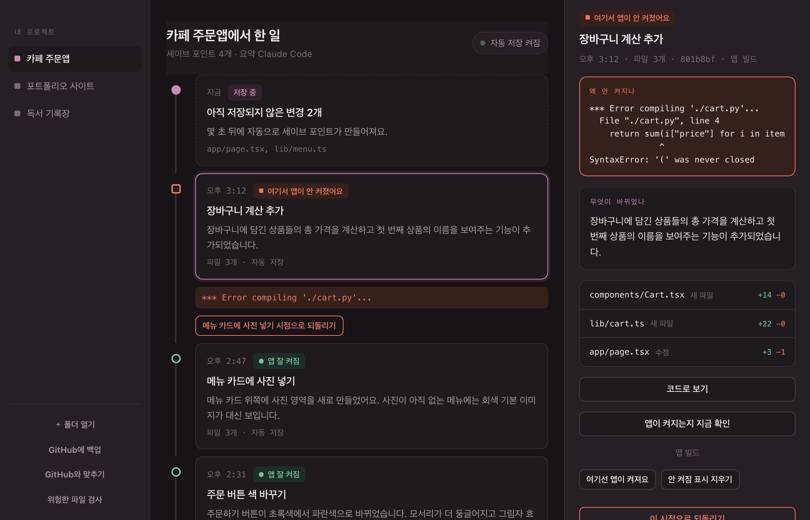
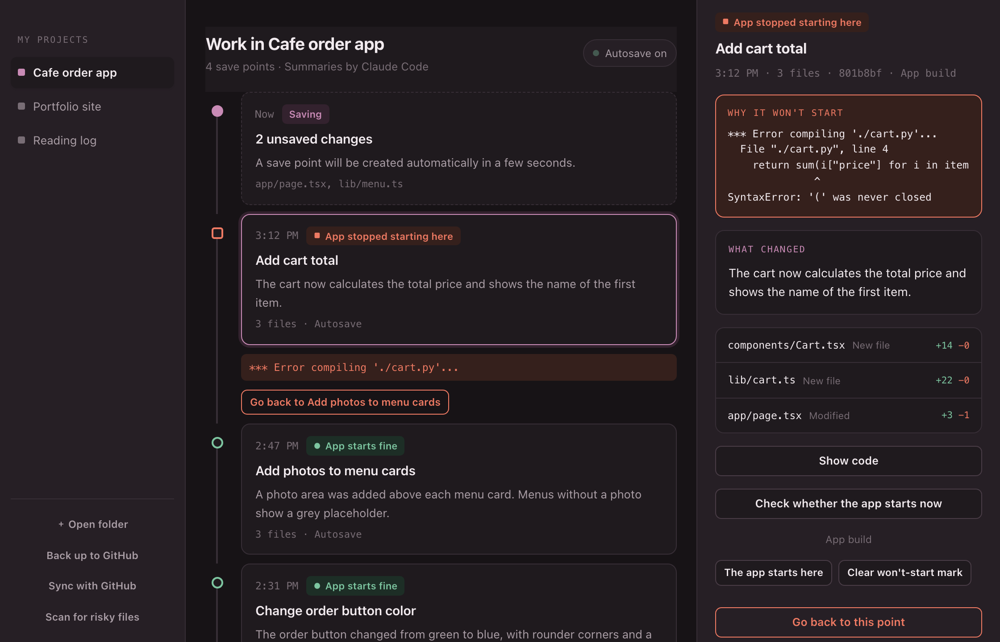
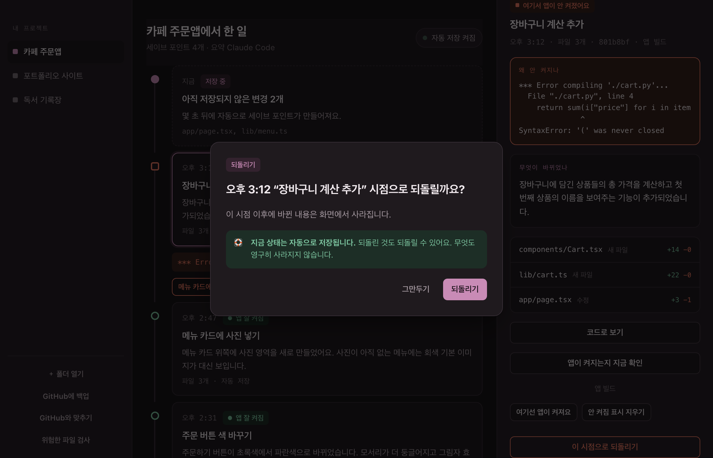
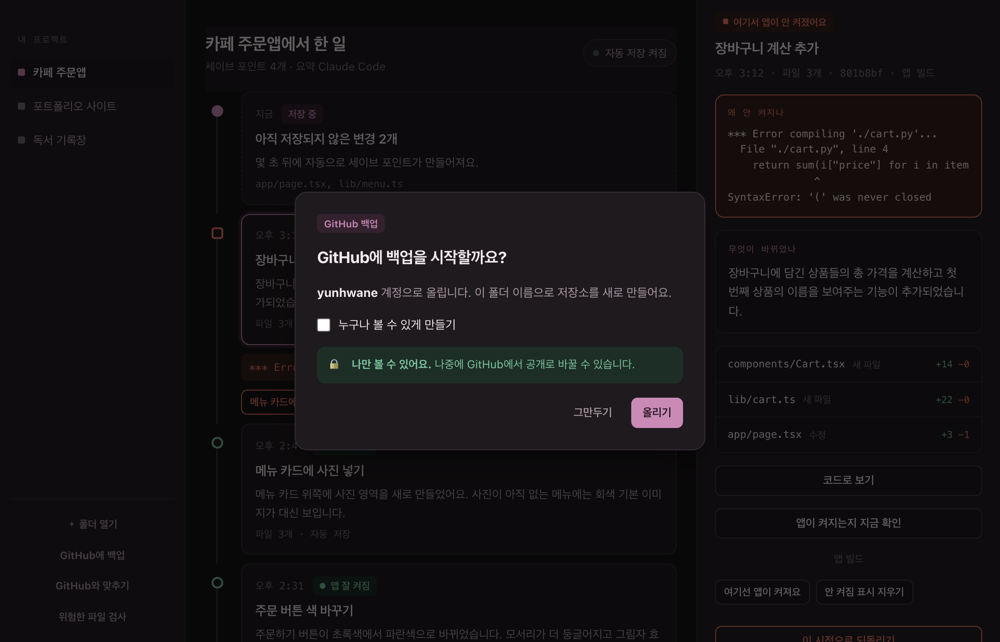
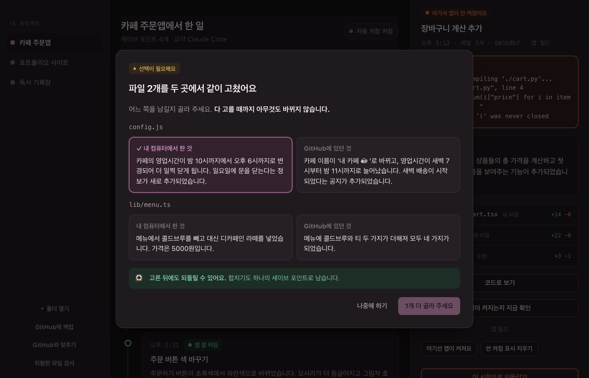
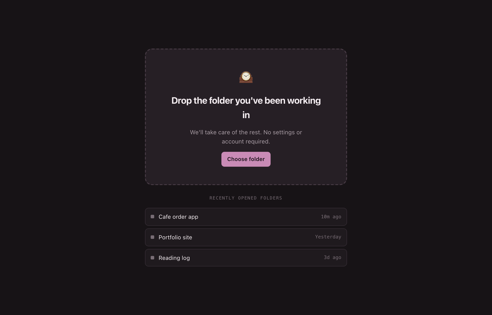

# Kigtit

**Confidence that you can undo.** Save points for people who build with AI.

[한국어](README.ko.md)

When you build by telling an AI what to do, things that used to work break. And
you have no idea which point to go back to. Kigtit solves only that.



There is no Git vocabulary anywhere. No commit button, no branches. What you get
is **a list of the things you asked for** and one **Go back to here** button.

> **The app's interface is in Korean.** Kigtit was built for Korean-speaking
> non-developers, and every label, summary and error explanation is written in
> Korean. The code, comments in this README, and the docs are in English so the
> design can be read and reused by anyone. Interface localization is
> [not done yet](#not-there-yet).

---

## What's different

### It tells you when the AI broke things

Every time it saves, it **actually tries to run your app.** So the timeline is
marked with `앱 잘 켜짐` (app starts fine) and `여기서 앱이 안 켜졌어요` (it
stopped starting here). It also tells you where to go back to.

Existing Git tools do not have this information at all. A list of commits alone
doesn't tell you which commit had a working app — you have to revert one by one
to find out.



It shows why, too. Even if you can't read code, you can tell that this point is
the problem and where to go instead.

### It explains changes in plain language

Not many people can read a diff. So every explanation is a sentence, not code.

> 메뉴 카드 위쪽에 사진 영역을 새로 만들었어요. 사진이 아직 없는 메뉴에는
> 회색 기본 이미지가 대신 보입니다.
>
> *(A photo area was added above each menu card. Menus without a photo yet show
> a grey placeholder instead.)*

Code only appears when you press "코드로 보기" (show me the code).

### Undo isn't scary



An undo becomes a save point of its own. So you can **undo the undo**, and
there is no path inside the app that destroys work permanently. The state right
before the undo is stored separately too.

### There is no save button

A few quiet seconds after a file changes, it saves on its own. While the AI is
still writing files it keeps waiting, so **one thing you asked for becomes one
save point.** You never have to learn that saving is something you must do.

### There is no screen that asks for an API key



Both the AI that writes the explanations and the GitHub backup **borrow tools
you have already signed into.** You never create or paste a token. Backups are
private by default; public is something you have to check on purpose.

Before uploading, it **scans for secret keys and refuses to upload if it finds
one.** A key that goes public gets scraped by bots within minutes.

### Conflicts never show you `<<<<<<< HEAD`



Editing the same file on two computers is usually where people give up. Kigtit
**explains in sentences what each side was trying to do** and asks only which
side to keep, per file. Nothing changes until you've chosen everything.

---

## Getting started



Drop the folder you've been working in. That's it. No account, no settings
screen, no checking whether Git is installed.

### Install

> **Honestly: right now you can't install this unless you're a developer.**
> There is no signed installer (.dmg) yet, so you have to build it. The install
> process commits the exact sin this product exists to fix. Ask a developer
> friend to run the lines below, or say so in an
> [issue](https://github.com/yunhwane/kigtit/issues).

```sh
git clone https://github.com/yunhwane/kigtit
cd kigtit
pnpm install
cargo tauri build
cp -R target/release/bundle/macos/Kigtit.app ~/Applications/
```

Requires macOS, [Rust](https://rustup.rs), and [Node](https://nodejs.org).

### Nice to have

Everything works without these.

| | What it improves | Without it |
|---|---|---|
| [Claude Code](https://claude.com/claude-code) or Codex | Changes explained in plain language | You get a file list only |
| [gh](https://cli.github.com) | GitHub backup and sync | Only the backup features are unavailable |

If they're already installed and signed in, Kigtit finds and uses them. There is
nothing to configure.

---

## The screens

| Screen | What it does |
|---|---|
| **Timeline** | Projects on the left, the list of things you asked for in the middle, details on the right. One dot is one thing you asked for |
| **Details** | Plain-language explanation on top, code only when you ask. The reason it won't start shows up here |
| **Undo** | Confirms where you're going back to, and tells you your current state is safe |
| **GitHub backup** | Private by default. Stops if there's a key |
| **A choice is needed** | Read both explanations, choose per file |
| **Key leak warning** | The only moment autosave interrupts you |

Reading the timeline:

| Mark | Meaning |
|---|---|
| Green circle | The app started fine at this point |
| Red square | **The app stopped starting here** — the reason and where to go back to come with it |
| Hollow circle | Not checked yet |
| Filled circle | Changes not saved yet |

Shape and colour are both used. It reads correctly if you're colour blind or
looking at it in black and white.

---

## It works in the terminal too

Everything the app does works from a terminal, because that's where building
with AI happens. Type `kigtit` and you get the timeline.


All 13 commands with examples are in **[Using the CLI](docs/cli.md)**.

---

## Further reading

- **[Using the CLI](docs/cli.md)** — every command, with real output
- **[How it's built](docs/design.md)** — design principles, the vocabulary
  mapping, how the health check works, why it takes no API keys
- **[Contributing](CONTRIBUTING.md)** — how to build, test, and send changes
- **[Changelog](CHANGELOG.md)**
- **[Screen designs](design/screens.html)** — open in a browser for a clickable
  mockup

## Not there yet

- **There is no signed installer.** Which means a non-developer cannot install
  this alone, and that is the biggest hole right now.
- **The interface is Korean only.** No localization layer exists yet; strings are
  inline in the components and in `crates/core`.
- macOS only.
- Keys that were deleted from history aren't detected. Only what's in the files
  right now gets caught.
- Conflict choices are per file. "Keep a bit of both" isn't possible.
- Multiple people working together isn't handled. One person across several
  machines is as far as it goes.
- **No non-developer has actually used this yet.** Every problem listed above is
  a hypothesis. If you've tried it, please
  [open an issue](https://github.com/yunhwane/kigtit/issues).

## License

MIT
